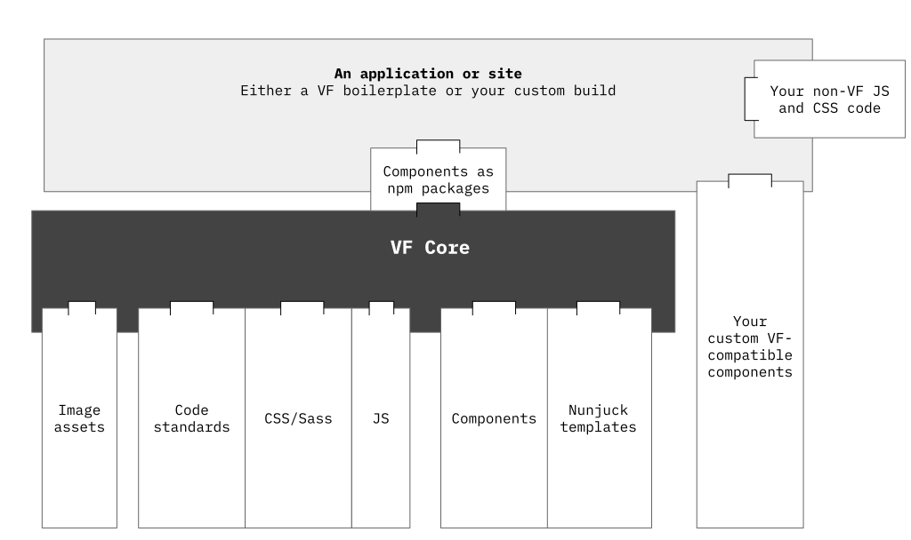

**👋 Downloading or cloning this repo? 🛑**

Most won't need to clone this repo. Do so if you only wish to [develop the architecture](https://stable.visual-framework.dev/developing/) of the Visual Framework core or contribute a global component, otherwise [use one of the boilerplates or install a component directly](https://stable.visual-framework.dev/).

---

# The Visual Framework Core (`vf-core`)

  

If you’re new to the Visual Framework system for life science websites: think of it as a Bootstrap but made for flexibility. The Visual Framework is highly modular for compatibility allowing for non-breaking use alongside other frameworks, like Bootstrap. So you can use components made elsewhere without breaking your site. [Learn more about the Visual Framework system here](https://stable.visual-framework.dev/).

This repo, for the "VF Core", is one part of that effort and — as the name suggests — is at the heart of all Visual Framework-based tools. The VF Core allows for extendable components and builds CSS, JS and other image-style assets.

*Much like an arch-based design of a cistern, the `vf-core` supports complex systems with a flexible space inside. (For those that didn’t guess it, this is a photo of the Basilica Cistern; [Image by Clint on Flickr](https://www.flickr.com/photos/amberandclint/4086669134/in/photolist-7e8fmE-nGAs7L-5ANpRm-bbDtk2-8fW4a-eZi5N3-5RRtw5-3KvouK-6K6fLC-48S7Tv-m1BVz9-77ZEvU-58GPp8-6ygYZw-5ANs87-5ANp2Q-48S9K6-gr8bps-evst93-7Vyo1U-evpjTg-e1EWNm-dUwmxf-q4ZFUa-auYW6V-7fFJXo-bstDTF-euKd7K-e9LAh3-5zSVSn-evpkb8-dtp995-5k2ATs-aj5HWY-8jbFnQ-MGp6W-57mU2S-bAKj6C-djW5iW-HVYU44-buCcrw-e6JLkQ-djW4bp-7DHGCa-av2Auo-28gPqDR-ea68SD-48S8hT-btjZH8-48W95A/))*

In short: The VF Core is a base to build systems.

*Here’s that column metaphor translates as a schematic of relationships for VF Core.*

The `vf-core` is built with:

- [Fractal](https://fractal.build/) for component structure
- Node and Gulp; to:
    - rollup JavaScript and handle assets
    - allow custom Sass/CSS components to be added to local projects
- [Dart Sass](https://github.com/sass/dart-sass)
- [Yeoman](https://yeoman.io/) to make custom components interactively
- [Yarn](https://yarnpkg.com/) to install components
- [Nunjucks](https://mozilla.github.io/nunjucks/templating.html) for component templates
- [Lerna](https://lerna.js.org/) to publish components to npm as a [mono-repo](https://www.toptal.com/front-end/guide-to-monorepos/)
- Name-spacing for JavaScript and CSS; more on that in [the coding standards](https://stable.visual-framework.dev/developing/#guidelines)

## Making use of the VF Core

[Here's a guide with the most common approaches](https://stable.visual-framework.dev/building/).

## FAQ

[Here's a guide to the most common questions](https://stable.visual-framework.dev/#faq).

## Have a problem?

See the [troubleshooting guide](https://stable.visual-framework.dev/troubleshooting).

## Want to help develop?

Great. See the [development guide](https://stable.visual-framework.dev/developing/).

---

## Have opinions, ideas, concerns or want to get involved?

There are a few ways that we discuss and track ideas:

- ⁉ General: [Chat us](https://join.slack.com/t/visual-framework/shared_invite/enQtNDAxNzY0NDg4NTY0LWFhMjEwNGY3ZTk3NWYxNWVjOWQ1ZWE4YjViZmY1YjBkMDQxMTNlNjQ0N2ZiMTQ1ZTZiMGM4NjU5Y2E0MjM3ZGQ) for general ideas and discussion
- ⚙️ Technical: [GitHub issues here](https://github.com/visual-framework/vf-core/issues) for implementing deeply technical and specific issues, like the Sass build process, browser bugs
